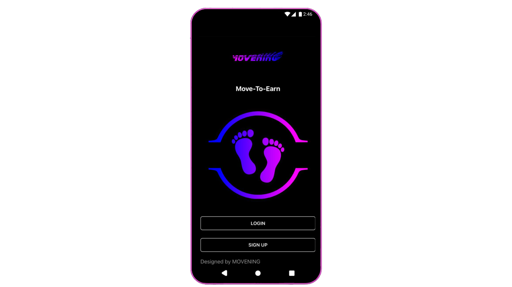

# App Movening

**Access to the Whitelist App Movening:**&#x20;

**1.-**  WhiteList Registration; Only any buyer in FairLaunch or holder of MOVI tokens can register.

**2.-** Once the Whitelist is closed, a draw will be held based on the number of tokens purchased. (0.1 BNB = 1 share)

**3.-** Because the use of sneakers is required for the App, the lucky ones who get a place on the Whitelist to test the App will be incentivized with a unique limited edition NFT.

&#x20;     ****     &#x20;

**Once the trial period has been passed, the steps to follow to start earning money doing sports as a good citizen must first be carried out a series of steps.**

**First step:** Buy your shoes (NFT).

**Second step:** select your preferred NFT from the gallery of available NFTs.

**Third step:** press GO! in the Moving app that you have on your smartphone or tablet.

**Fourth step:** when you finish running or doing your favorite sport you can claim your rewards.

There will be a certain time to carry out your favorite activities and it is 50 minutes a day, choose them when you feel like it or feel motivated!

Things to keep in mind:

Once the **GO** button is pressed, time begins to count down, you better be prepared because time is ticking and as everyone knows, time is money!

There will be types of shoes suitable for each level of exercise, from the light level to the extreme level.

**-Soft shoes:** minimum number of steps 1000, maximum number 5000. It has a bonus of 8.

**-Medium shoes:** minimum number of steps 3500, maximum number 8500. It has a bonus of 9.

**-Extreme shoes:** minimum number of steps 6500, maximum number 15500. It has a bonus of 10.

You have to take into account the rare shoes since their level of earning token is different.

|   Rarity  |        Efficiency        |        Durability       |
| :-------: | :----------------------: | :---------------------: |
|    Rare   |  minimum 300 maximum 500 | minimum 100 maximum 200 |
| Very rare |  minimum 500 maximum 800 | minimum 200 maximum 400 |
|    Epic   | minimum 800 maximum 1100 | minimum 300 maximum 500 |

s
