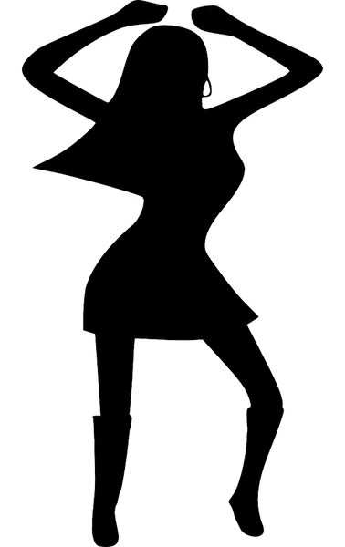

# Energy

Our energy is basically made up of snacks that feed our desire to be fit. There are several classes:&#x20;

**Energy level 1:** Water, without water there is no life.&#x20;

E**nergy level 2:** Isotonic drink, just drink it.&#x20;

**Energy level 3:** Sugary drink that allows you to shorten the waiting time between wearing sneakers.

